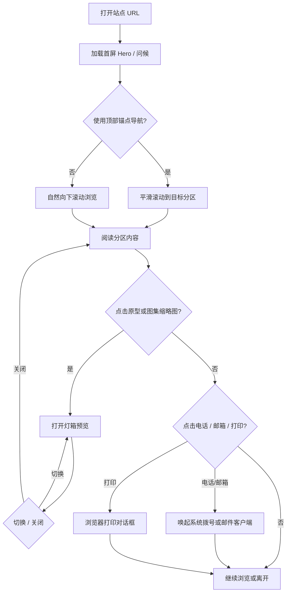
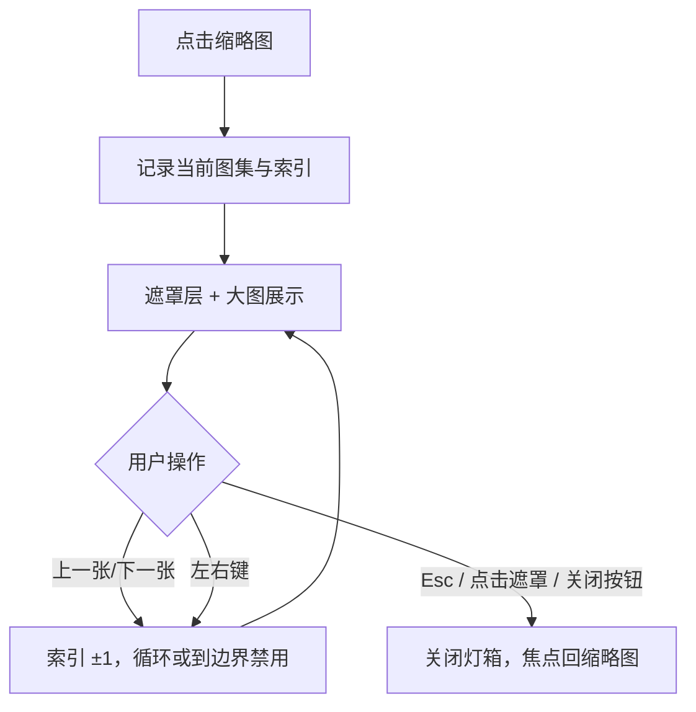
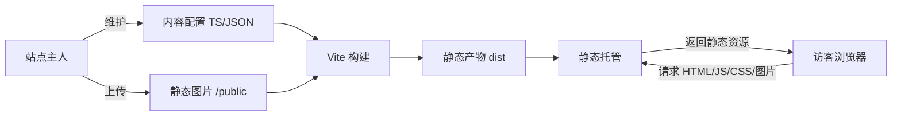
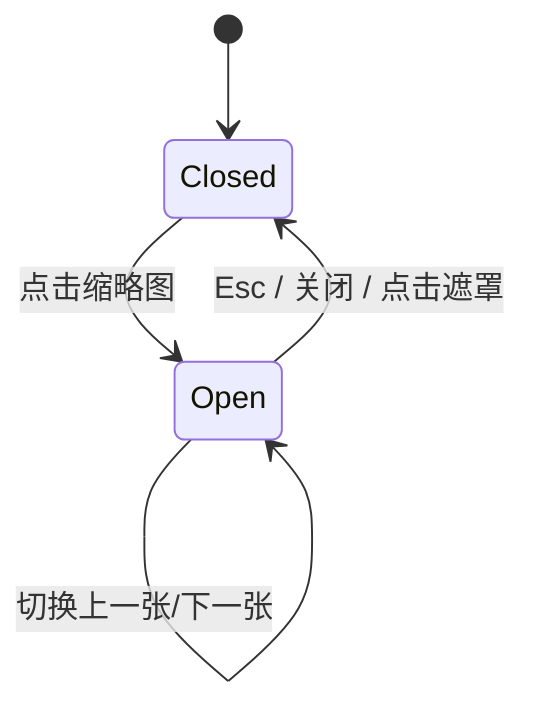
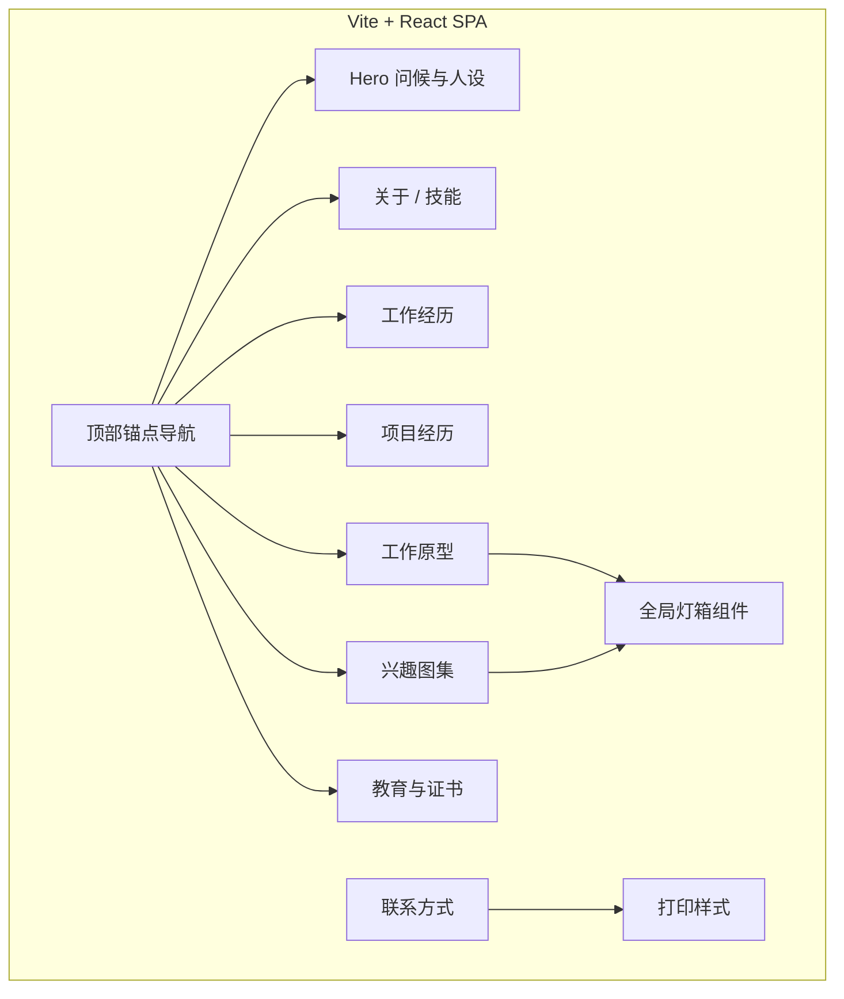

# 王怡阳个人作品站 产品需求文档（PRD）

版本号：V1.0.0

| 版本 | 时间 | 修订人 | 备注 |
|------|------|--------|------|
| V1.0.0 | 2026/07/20 | 产品 | 创建 V1.0.0：Vite + React 静态个人站（方案 A 单页为主） |

---

## 一、概述（为什么做）

### 1.1 产品概述及目标

#### 1.1.1 背景介绍

当前已有一份 HTML 静态简历（`index.html`），信息完整但偏「文档排版」，不利于在招聘场景中快速建立人设记忆，也缺少原型作品与兴趣侧面的展示。

招聘方在初筛时通常只有 30–60 秒浏览个人页。需要一个**亲切又专业**的单页作品站：先抓住「我是谁 / 我能做什么」，再下钻简历细节、公开原型与生活图集。风格参考 [陈晏声个人站](https://chenyanzhi.notion.site/personweb)：问候式开场、清晰分区、图集策展感，但内容与信息架构面向 ToB 产品经理求职场景。

#### 1.1.2 产品概述

本产品是一个用 **Vite + React** 构建的**纯前端静态个人网站**，以单页滚动为主（方案 A），通过锚点分区呈现：人设介绍、职业技能、工作经历、项目经历、工作原型图、兴趣图集、教育与联系方式。无后端、无登录、无服务端接口；内容以静态资源与配置数据驱动。

#### 1.1.3 产品目标

**业务目标**

| 目标 | 指标 | 目标值 | 达成时间 |
|------|------|--------|---------|
| 支撑求职投递 | 可分享的个人站 URL | 完成部署并可访问 | V1.0 上线时 |
| 简历信息完整迁移 | 与现有 `index.html` 内容对齐率 | 100%（字段与文案不丢） | V1.0 |
| 展示作品侧面 | 可公开原型图数量 | 5–6 张可预览 | V1.0 |
| 展示兴趣侧面 | 摄影 / 运动图集可浏览 | 各至少 1 组图集 | V1.0 |

**用户目标**

| 目标用户 | 用户目标 | 衡量指标 |
|---------|---------|---------|
| 招聘方 / 面试官 | 1 分钟内理解候选人定位与核心项目 | 首屏可见姓名、角色、一句话定位；滚动可达项目与原型 |
| 招聘方 / 面试官 | 快速查看可公开的产品原型能力 | 原型缩略图可点击放大，无需离开站点 |
| 招聘方 / 面试官 | 了解候选人性格与兴趣侧面 | 摄影 / 运动图集可浏览 |

#### 1.1.4 目标用户

| 角色 | 描述 | 核心诉求 |
|------|------|---------|
| 招聘方 / HR | 初筛与约面决策者 | 快速判断匹配度，联系方式清晰 |
| 面试官 / 业务方 | 深度了解项目与产品能力 | 项目叙事清晰，原型可看 |
| 站点主人（王怡阳） | 维护与更新内容 | 改文案 / 换图成本低，结构清晰 |

> **[假设]** 暂无对外客户 / 同行运营诉求；不做英文版；不做访问登录。

### 1.2 名词说明

| 名词 | 说明 |
|------|------|
| 方案 A | 单页作品集：一页多分区，锚点导航滚动 |
| 方案 B（后续） | 多路由分区页；V1.0 仅预留锚点命名与模块边界，不做独立路由 |
| 原型图 | 工作中可公开的产品原型 / 界面截图（已脱敏） |
| 图集 | 按主题聚合的图片组（摄影、运动） |
| 灯箱（Lightbox） | 点击缩略图后全屏 / 居中大图预览，可左右切换、关闭 |
| 内容配置 | 简历与作品元数据以 TS/JSON 静态配置维护，非 CMS |

### 1.3 角色及权限

| 角色 | 权限范围 | 数据范围 |
|------|---------|---------|
| 访客 | 浏览全部公开内容、预览图片、跳转联系方式 | 全部公开静态内容 |
| 站点主人 | 通过改代码 / 配置 / 静态资源更新站点（开发时） | 仓库内全部资源 |

> 无账号体系；无权限分级。

### 1.4 文档阅读对象

| 对象 | 关注内容 |
|------|---------|
| 前端研发 | 功能需求、组件划分、内容数据结构、交互与异常 |
| 设计（可选） | 视觉气质、分区布局、图集与灯箱交互 |
| 测试 / 自测 | 验收标准、空态与图片失败态 |
| 站点主人 | 内容迁移清单、待确认素材 |

---

## 二、产品描述（做什么）

### 2.1 产品需求描述

**做什么**

- 用 Vite + React 实现静态个人站（SPA 单页）
- 完整迁入现有简历内容（技能、经历、项目、教育、证书、自我介绍、联系方式）
- 增加「工作原型」模块（约 5–6 张公开图 + 灯箱）
- 增加「兴趣爱好」图集（摄影、运动）
- 气质：**亲切问候 + 专业信息密度**，对标参考站的「小屋」感，同时满足招聘扫读

**不做什么（V1.0）**

- 不做后端、CMS、数据库、登录、留言板、联系表单提交
- 不做英文版 / 暗色模式（**[待确认]** 暗色可放 V1.1）
- 不做博客、文章库、付费产品区（参考站有，本站不复制业务模块）
- 不做独立多路由页面（方案 B 仅规划，V1.0 用锚点分区模拟导航）
- 不做强制埋点 SDK（可选轻量统计见 4.2）

**硬性约束**

- 技术栈：Vite + React + TypeScript（**[假设]** 使用 TS）
- 部署：静态托管（GitHub Pages / Vercel / Netlify 任一，**[待确认]**）
- 语言：仅中文
- 视觉：亲切专业；延续现有简历青绿主色方向，避免模板化紫渐变 / 报纸排版风

### 2.2 产品整体流程

#### 2.2.1 主流程（访客浏览）



#### 2.2.2 子流程：灯箱预览



#### 2.2.3 数据流图（DFD）

纯静态站，无服务端处理。数据流如下：



#### 2.2.4 状态转换图

本站无业务单据状态。灯箱 UI 状态：



### 2.3 全局说明

#### 2.3.1 全局异常处理

| 异常场景 | 处理方式 | 提示文案 |
|---------|---------|---------|
| 图片加载失败 | 显示占位块 + 简短说明，不影响其他内容 | 「图片暂时无法加载」 |
| 内容配置缺字段 | 该块不渲染或显示空态，控制台 warn（开发态） | 分区内：「内容准备中」 |
| 锚点无效 | 忽略跳转，停留当前位置 | — |
| 打印样式异常 | 提供 `@media print`：隐藏导航悬浮层与灯箱 | — |
| 无网络（已打开页） | 已缓存资源可继续浏览；新图失败走图片失败态 | 「图片暂时无法加载」 |

> 无登录 / 无接口，故无权限异常、服务超时等后端类异常。

#### 2.3.2 列表 / 图集规则

| 规则项 | 说明 |
|--------|------|
| 分页 | V1.0 不做分页；图集一次展示全部缩略图 |
| 排序 | 项目按简历既有顺序；原型 / 图集按配置数组顺序 |
| 筛选 | V1.0 不做标签筛选（**[假设]** V1.1 可按「获客 / MA / AI」筛原型） |
| 空数据 | 分区显示「内容准备中」，不留大片空白无说明 |
| 图片比例 | 缩略图统一裁切比例（建议 4:3），大图按原图 `object-fit: contain` |

#### 2.3.3 全局交互

| 场景 | 交互方式 |
|------|---------|
| 锚点导航 | 平滑滚动；当前分区高亮（IntersectionObserver） |
| 加载中 | 首屏骨架或淡入；图片可用 blur-up / 渐显 |
| 灯箱打开 | `body` 滚动锁定；焦点陷阱在灯箱内 |
| 外部链接 | `mailto:` / `tel:` 使用系统默认行为 |
| 打印 | 工具栏「打印 / 导出 PDF」调用 `window.print()` |
| 空状态 | 文案提示，无夸张插画（保持专业） |
| 动效 | 入场 fade-up、导航高亮过渡；克制，避免干扰阅读 |

### 2.4 产品版本规划（里程碑）

| 版本 | 范围 | 计划时间 | 状态 |
|------|------|---------|------|
| V1.0 | 单页：简历全量 + 原型灯箱 + 兴趣图集 + 打印 | **[待确认]** | 进行中 |
| V1.1 | 方案 B 路由拆分、暗色模式、原型标签筛选、可选访问统计 | 规划中 | 规划中 |
| V2.0 | 英文版、博客 / 笔记（若需要） | 远期 | 远期 |

### 2.5 产品框架



**信息架构（单页分区，自上而下）**

1. Hero（问候 + 姓名 + 角色 + 联系摘要）
2. 关于我 / 职业技能
3. 工作经历
4. 项目经历
5. 工作原型
6. 兴趣爱好（摄影 / 运动）
7. 教育背景与证书 + 一句话介绍
8. 页脚联系

### 2.6 功能清单

| 模块 | 功能 | 优先级 | 版本 | 说明 |
|------|------|--------|------|------|
| 全局 | 单页布局 + 响应式 | P0 | V1.0 | 桌面 / 移动 |
| 全局 | 顶部锚点导航 | P0 | V1.0 | 对应各分区 |
| 全局 | 打印 / 导出 PDF | P1 | V1.0 | 沿用简历站能力 |
| Hero | 问候语 + 姓名 + 角色 + meta | P0 | V1.0 | 亲切开场 |
| 技能 | 四条核心技能文案 | P0 | V1.0 | 来自现有简历 |
| 经历 | 两段工作经历 | P0 | V1.0 | 弟齐 / 百胜 |
| 项目 | 四个项目详情列表 | P0 | V1.0 | 含标签与要点 |
| 原型 | 5–6 张缩略图 + 灯箱 | P0 | V1.0 | 可公开 |
| 兴趣 | 摄影 / 运动两个图集 | P0 | V1.0 | 偏图集 |
| 教育 | 学校、专业、证书、简介 | P0 | V1.0 | — |
| 联系 | 电话、邮箱可点击 | P0 | V1.0 | — |
| 增强 | 暗色模式 | P2 | V1.1 | — |
| 增强 | 多路由方案 B | P2 | V1.1 | — |
| 增强 | 访问统计 | P2 | V1.1 | 可选 |

---

## 三、功能需求（怎么做）

### 3.1 全局壳层与导航

#### 3.1.1 描述

提供整站布局、顶部锚点导航、当前分区高亮、移动端适配及打印入口。

#### 3.1.2 用户故事

```
作为招聘方，我希望通过顶部导航快速跳到「项目」或「原型」，以便在短时间内定位关键信息。
作为站点主人，我希望打印样式干净，以便导出 PDF 投递。
```

#### 3.1.3 前置条件

| 类型 | 条件 |
|------|------|
| 数据依赖 | 各分区 `id` 与导航配置一致 |
| 功能依赖 | 无 |

#### 3.1.4 后置条件

- 点击导航后 URL hash 更新（如 `#projects`），支持分享深链到分区
- 打印时隐藏固定导航与灯箱

#### 3.1.5 界面及交互

| 元素 | 类型 | 必填 | 默认值 | 校验规则 | 操作反馈 |
|------|------|------|--------|---------|---------|
| Logo / 姓名短称 | 文本 / 链接 | 是 | 王怡阳 | — | 点击回顶部 |
| 导航项 | 锚点链接 | 是 | 关于 / 经历 / 项目 / 原型 / 兴趣 / 教育 | 与分区 id 映射 | 平滑滚动 + 高亮 |
| 打印按钮 | Button | 否 | 打印 / 导出 PDF | — | 调用 `window.print()` |
| 移动端菜单 | 折叠菜单 | 是（≤720px） | 汉堡展开 | — | 点击项后自动收起 |

**导航文案建议**

| 导航 | 锚点 id |
|------|---------|
| 关于 | `#about` |
| 经历 | `#experience` |
| 项目 | `#projects` |
| 原型 | `#prototypes` |
| 兴趣 | `#hobbies` |
| 教育 | `#education` |

#### 3.1.6 业务流程

见 2.2.1 主流程。

#### 3.1.7 异常/分支流程

| 场景 | 触发条件 | 处理方式 | 提示文案 |
|------|---------|---------|---------|
| hash 无对应分区 | 手动改 URL | 忽略，停留顶部 | — |
| 移动端菜单打开时旋转屏 | resize | 按新断点重算布局，必要时关闭菜单 | — |

#### 3.1.8 数据字典

| 字段名 | 类型 | 必填 | 说明 | 示例值 |
|--------|------|------|------|--------|
| id | string | 是 | 锚点 id | `"projects"` |
| label | string | 是 | 导航展示名 | `"项目"` |
| order | number | 是 | 排序 | `3` |

---

### 3.2 Hero（问候与人设）

#### 3.2.1 描述

首屏建立亲切印象与专业定位：问候语、姓名、角色、关键 meta、联系方式摘要。

#### 3.2.2 用户故事

```
作为招聘方，我希望打开页面立刻看到姓名、岗位方向与年限，以便判断是否继续阅读。
作为招聘方，我希望语气亲切但不随意，以便留下靠谱又好沟通的印象。
```

#### 3.2.3 前置条件

无。

#### 3.2.4 后置条件

无状态变更；仅展示。

#### 3.2.5 界面及交互

| 元素 | 类型 | 必填 | 默认值 | 校验规则 | 操作反馈 |
|------|------|------|--------|---------|---------|
| 问候语 | 文本 | 是 | 见下方文案 | ≤40 字 | — |
| 姓名 | H1 | 是 | 王怡阳 | — | — |
| 角色行 | 文本 | 是 | ToB 产品经理｜2 年工作经验 | — | — |
| Meta 行 | 文本 + 链接 | 是 | 出生年 / 城市 / 专业 / 电话 / 邮箱 | 电话 `tel:`，邮箱 `mailto:` | 点击唤起系统应用 |
| 主 CTA | 按钮 / 锚点 | 建议 | 「看看项目」→ `#projects` | — | 滚动到项目 |

**问候语文案 [假设]**

> 「你好啊，欢迎来到我的个人站。我是王怡阳，一名做 ToB SaaS 的产品经理。」

气质对齐参考站「你好啊，亲爱的朋友！」——保留招呼感，去掉过度私密称呼，适配招聘场景。

#### 3.2.6 业务流程

静态展示，无流程分支。

#### 3.2.7 异常/分支流程

| 场景 | 触发条件 | 处理方式 | 提示文案 |
|------|---------|---------|---------|
| 邮箱客户端未配置 | 点击 mailto | 浏览器默认行为 | 由系统处理 |

#### 3.2.8 数据字典

| 字段名 | 类型 | 必填 | 说明 | 示例值 |
|--------|------|------|------|--------|
| greeting | string | 是 | 问候语 | 见上 |
| name | string | 是 | 姓名 | `"王怡阳"` |
| role | string | 是 | 角色与年限 | `"ToB 产品经理｜2 年工作经验"` |
| birth | string | 是 | 出生年月 | `"2001.01"` |
| location | string | 是 | 城市 | `"江苏南京"` |
| major | string | 是 | 专业 | `"信息管理与信息系统"` |
| phone | string | 是 | 手机号 | `"18086737553"` |
| email | string | 是 | 邮箱 | `"des65071@gmail.com"` |

---

### 3.3 职业技能（关于）

#### 3.3.1 描述

展示四条职业技能要点，文案与现有 `index.html` 完全一致。

#### 3.3.2 用户故事

```
作为招聘方，我希望先看到能力摘要，以便决定是否阅读项目细节。
```

#### 3.3.3–3.3.4 前后置条件

无特殊依赖；纯展示。

#### 3.3.5 界面及交互

| 元素 | 类型 | 必填 | 默认值 | 校验规则 | 操作反馈 |
|------|------|------|--------|---------|---------|
| 分区标题 | 标题 | 是 | 职业技能 | — | — |
| 技能条目 | 列表 / 段落 | 是 | 4 条 | 每条含加粗前缀 | — |

条目内容（迁入，不可删减）：

1. **核心优势：** B 端 SaaS…（原文）
2. **专业技能：** Figma、MasterGo、SQL…（原文）
3. **AI 产品经验：** Cursor、CodeX、Claude Code…（原文）
4. **协同交付：** 敏捷、PRD、验收…（原文）

#### 3.3.8 数据字典

| 字段名 | 类型 | 必填 | 说明 | 示例值 |
|--------|------|------|------|--------|
| label | string | 是 | 加粗前缀 | `"核心优势"` |
| content | string | 是 | 正文 | `"具备 B 端 SaaS…"` |

---

### 3.4 工作经历

#### 3.4.1 描述

展示两段工作经历：公司、职位徽章、时间、职责描述。

#### 3.4.2 用户故事

```
作为面试官，我希望按时间线看清任职公司与职责，以便对照 JD。
```

#### 3.4.5 界面及交互

| 元素 | 类型 | 必填 | 默认值 | 校验规则 | 操作反馈 |
|------|------|------|--------|---------|---------|
| 公司名 | 标题 | 是 | — | — | — |
| 职位徽章 | Badge | 是 | 产品经理 / 产品助理 | — | — |
| 时间 | time | 是 | `YYYY.MM — YYYY.MM/至今` | — | — |
| 职责描述 | 段落 | 是 | 简历原文 | — | — |

#### 3.4.8 数据字典

| 字段名 | 类型 | 必填 | 说明 | 示例值 |
|--------|------|------|------|--------|
| company | string | 是 | 公司名 | `"南京弟齐信息技术有限公司"` |
| title | string | 是 | 职位 | `"产品经理"` |
| start | string | 是 | 开始 | `"2024.06"` |
| end | string | 是 | 结束，至今用 `"至今"` | `"至今"` |
| description | string | 是 | 职责 | `"围绕企业获客…"` |

数据源（V1.0 固定两条）：弟齐 2024.06—至今；百胜中国 2023.06—2024.04。文案以 `index.html` 为准。

---

### 3.5 项目经历

#### 3.5.1 描述

展示四个项目：标题、标签、描述、要点列表。支持长文阅读，移动端保持可读行宽。

#### 3.5.2 用户故事

```
作为面试官，我希望看到 0-1 与闭环相关的项目叙事和结果数字，以便深挖追问。
```

#### 3.5.5 界面及交互

| 元素 | 类型 | 必填 | 默认值 | 校验规则 | 操作反馈 |
|------|------|------|--------|---------|---------|
| 项目标题 | H3 | 是 | — | — | — |
| 项目标签 | Tag | 是 | 如「0-1 搭建」 | — | 强调色展示 |
| 项目描述 | 段落 | 是 | 含「项目描述：」 | — | — |
| 要点列表 | ul/li | 是 | ≥1 条 | — | — |

四个项目（全文迁入）：

1. 线索获取与统一数据平台搭建（0-1 搭建）
2. 线索培育与营销自动化体系建设（精细化运营）
3. 线索评分与销售协同转化体系建设（闭环增长）
4. AI 知识库与智能线索挖掘系统（AI + 营销）

#### 3.5.7 异常/分支流程

| 场景 | 触发条件 | 处理方式 | 提示文案 |
|------|---------|---------|---------|
| 配置为空数组 | 误删数据 | 显示空态 | 「项目内容准备中」 |

#### 3.5.8 数据字典

| 字段名 | 类型 | 必填 | 说明 | 示例值 |
|--------|------|------|------|--------|
| id | string | 是 | 稳定 id | `"lead-platform"` |
| title | string | 是 | 标题 | `"线索获取与统一数据平台搭建"` |
| tag | string | 是 | 标签 | `"0-1 搭建"` |
| summary | string | 是 | 项目描述 | `"从 0 到 1 搭建…"` |
| bullets | string[] | 是 | 要点 | `["多渠道线索获取：…"]` |

---

### 3.6 工作原型

#### 3.6.1 描述

展示约 5–6 张可公开的工作原型 / 界面图：网格缩略图 + 灯箱大图预览，可选标题与一句话说明。

#### 3.6.2 用户故事

```
作为面试官，我希望直接看到原型成果，以便评估交互与信息架构表达能力。
作为站点主人，我希望图片可替换，以便后续更新作品。
```

#### 3.6.3 前置条件

| 类型 | 条件 |
|------|------|
| 数据依赖 | `/public/prototypes/` 下图片已就位，配置已填写 |
| 合规 | 图片已脱敏，可公开 |

#### 3.6.4 后置条件

- 打开灯箱时页面不可滚动
- 关闭后恢复滚动位置

#### 3.6.5 界面及交互

| 元素 | 类型 | 必填 | 默认值 | 校验规则 | 操作反馈 |
|------|------|------|--------|---------|---------|
| 分区导语 | 文本 | 建议 | 「部分可公开的工作原型（已脱敏）」 | — | — |
| 缩略图卡片 | 图片按钮 | 是 | 5–6 张 | 支持 jpg/png/webp | 点击开灯箱 |
| 图标题 | 文本 | 否 | 可选 | ≤20 字 | — |
| 灯箱大图 | 图片 | 是 | 当前项 | — | 左右切换 |
| 关闭 | 按钮 | 是 | × | — | 关闭灯箱 |
| 计数器 | 文本 | 建议 | `2 / 6` | — | — |

**布局：** 桌面 3 列，平板 2 列，手机 1–2 列。

#### 3.6.6 业务流程

见 2.2.2 灯箱子流程。

#### 3.6.7 异常/分支流程

| 场景 | 触发条件 | 处理方式 | 提示文案 |
|------|---------|---------|---------|
| 单张图 404 | src 错误 | 占位 + 仍可切换其他图 | 「图片暂时无法加载」 |
| 图集为空 | 未上传 | 空态 | 「原型整理中，稍后更新」 |
| 快速连点 | 重复点击 | 灯箱已开则忽略或切到对应索引 | — |

#### 3.6.8 数据字典

| 字段名 | 类型 | 必填 | 说明 | 示例值 |
|--------|------|------|------|--------|
| id | string | 是 | 唯一 id | `"proto-01"` |
| src | string | 是 | 图片路径 | `"/prototypes/ma-workflow.png"` |
| title | string | 否 | 标题 | `"营销自动化 Workflow"` |
| caption | string | 否 | 一句话说明 | `"基于行为触发的自动触达"` |
| order | number | 是 | 排序 | `1` |

> **[待确认]** 5–6 张图的具体文件名、标题、说明文案，由站点主人提供素材后填入配置。

---

### 3.7 兴趣爱好（图集）

#### 3.7.1 描述

以图集形式展示「摄影」「运动」两个主题；可 Tab / 分段切换，缩略图进同一套灯箱。

#### 3.7.2 用户故事

```
作为招聘方，我希望快速扫一眼兴趣图集，以便感受候选人生活侧面与审美。
```

#### 3.7.5 界面及交互

| 元素 | 类型 | 必填 | 默认值 | 校验规则 | 操作反馈 |
|------|------|------|--------|---------|---------|
| 主题切换 | Tab / 分段 | 是 | 摄影 / 运动 | 两个主题 | 切换网格内容 |
| 缩略图网格 | 图片按钮 | 是 | 每主题 ≥3 张 **[假设]** | — | 开灯箱 |
| 导语 | 短文本 | 否 | 一句即可 | ≤40 字 | — |

**展示参考：** 对齐参考站「图片策展」分区的图集感——干净网格、少文案、图为主。

#### 3.7.7 异常/分支流程

同 3.6.7；某主题为空时该 Tab 显示空态，不影响另一主题。

#### 3.7.8 数据字典

| 字段名 | 类型 | 必填 | 说明 | 示例值 |
|--------|------|------|------|--------|
| albumId | string | 是 | `photography` / `sports` | `"photography"` |
| albumName | string | 是 | 展示名 | `"摄影"` |
| images[].id | string | 是 | 图片 id | `"photo-01"` |
| images[].src | string | 是 | 路径 | `"/hobbies/photo-01.jpg"` |
| images[].alt | string | 是 | 无障碍描述 | `"南京街头摄影"` |

> **[待确认]** 每本图集张数与最终选图；**[假设]** 每主题先放 4–8 张以保证图集感。

---

### 3.8 教育背景与自我介绍

#### 3.8.1 描述

展示学校、专业、时间、证书徽章、自我介绍段落。内容迁自现有简历。

#### 3.8.5 界面及交互

| 元素 | 类型 | 必填 | 默认值 | 校验规则 | 操作反馈 |
|------|------|------|--------|---------|---------|
| 学校 | 文本 | 是 | 徐州工程学院（统招本科） | — | — |
| 专业 | 文本 | 是 | 信息管理与信息技术 | — | 注意与 Hero 专业表述差异，**以简历原文为准分别展示** |
| 时间 | time | 是 | 2020.09 — 2024.06 | — | — |
| 证书 | Chip | 是 | 软考·软件设计师；英语六级 | — | — |
| 自我介绍 | 引用块 / 段落 | 是 | 效率与结果先行… | — | — |

> **[待确认]** Hero 写「信息管理与信息系统」、教育写「信息管理与信息技术」——是否统一用词，或保持简历原文不动。

#### 3.8.8 数据字典

| 字段名 | 类型 | 必填 | 说明 | 示例值 |
|--------|------|------|------|--------|
| school | string | 是 | 学校 | `"徐州工程学院（统招本科）"` |
| major | string | 是 | 专业 | `"信息管理与信息技术"` |
| period | string | 是 | 在读时间 | `"2020.09 — 2024.06"` |
| certificates | string[] | 是 | 证书 | `["软考 · 软件设计师","英语六级"]` |
| intro | string | 是 | 自我介绍 | `"效率与结果先行…"` |

---

### 3.9 全局灯箱组件

#### 3.9.1 描述

可复用于原型与兴趣图集的图片预览组件。

#### 3.9.2 用户故事

```
作为访客，我希望全屏看清图片细节，并能用键盘切换，以便高效浏览作品。
```

#### 3.9.5 界面及交互

| 元素 | 类型 | 必填 | 默认值 | 校验规则 | 操作反馈 |
|------|------|------|--------|---------|---------|
| 遮罩 | 全屏半透明 | 是 | — | 点击关闭 | 关闭 |
| 大图 | img | 是 | — | contain | — |
| 上一张 / 下一张 | 按钮 | 是 | — | 边界可循环 **[假设：循环]** | 切图 |
| 关闭 | 按钮 | 是 | — | Esc 亦可 | 关闭 |
| 标题 / 说明 | 文本 | 否 | 来自配置 | — | — |

#### 3.9.7 异常/分支流程

| 场景 | 触发条件 | 处理方式 | 提示文案 |
|------|---------|---------|---------|
| 仅 1 张图 | length=1 | 隐藏或禁用左右切换 | — |
| 焦点在灯箱外 Tab | 打开态 | 焦点陷阱 | — |

#### 3.9.8 数据字典

运行时状态（非持久化）：

| 字段名 | 类型 | 必填 | 说明 | 示例值 |
|--------|------|------|------|--------|
| open | boolean | 是 | 是否打开 | `true` |
| items | ImageItem[] | 是 | 当前序列 | — |
| index | number | 是 | 当前索引 | `0` |

---

## 四、非功能需求（注意事项）

### 4.1 安全与合规需求

| 需求 | 说明 |
|------|------|
| 公开信息最小化 | 仅展示自愿公开的电话、邮箱、作品图 |
| 原型脱敏 | 上线前确认无客户敏感数据、内部未公开指标、未授权 Logo |
| 传输安全 | 部署启用 HTTPS（托管方默认） |
| 无账号 | 无密码、无 Cookie 登录态 |
| 第三方脚本 | V1.0 默认不引入未评估的统计 / 广告脚本 |

### 4.2 统计需求（埋点）

V1.0 **不做强制埋点**。若后续需要，建议：

| 事件名 | 触发时机 | 属性 | 说明 |
|--------|---------|------|------|
| page_view | 首屏加载完成 | `page=home` | PV |
| nav_click | 点击锚点导航 | `target_id` | 分区兴趣 |
| prototype_open | 打开原型灯箱 | `proto_id`, `index` | 作品关注度 |
| hobby_open | 打开兴趣灯箱 | `album_id`, `index` | — |
| contact_click | 点击电话/邮箱 | `type=phone\|email` | 转化意向 |
| print_click | 点击打印 | — | — |

> **[待确认]** V1.0 是否接入 Plausible / Umami 等隐私友好统计（仍无后端也可）。

### 4.3 性能需求

| 指标 | 要求 |
|------|------|
| 首屏可交互 | 常规宽带下 LCP < 2.5s **[待确认，建议值]** |
| 包体 | 首屏 JS gzip 后尽量 < 200KB **[待确认，建议值]** |
| 图片 | 使用 WebP/压缩；缩略图与大图可同图不同尺寸 **[假设]** V1.0 可先同图，注意单张 < 500KB |
| 路由 | 单页无服务端渲染要求 |
| 兼容 | 最近两个版本的 Chrome / Edge / Safari；iOS Safari 可用 |

### 4.4 数据库设计

无数据库。内容存储方案：

| 存储 | 说明 |
|------|------|
| `src/data/*.ts` | 简历与作品元数据 |
| `public/prototypes/` | 原型原图 |
| `public/hobbies/` | 兴趣原图 |

数据生命周期：随 Git 版本管理；下线即删资源文件。

### 4.5 系统集成

| 对接系统 | 接口方向 | 协议 | 说明 |
|---------|---------|------|------|
| 静态托管 | 部署产物 | HTTPS | GitHub Pages / Vercel / Netlify **[待确认]** |
| 系统拨号 / 邮件 | 浏览器唤起 | `tel:` / `mailto:` | 无 API |
| 字体 | 可选 Google Fonts 或自托管 | HTTPS | **[假设]** 延续 Outfit + Noto Sans SC，或改为自托管以免国内加载慢 |

> 第三方字体不可用时：降级系统字体栈，页面仍可用。

---

## 五、附录

### 5.1 验收标准与测试要点

| 功能 | 验收条件 | 优先级 |
|------|---------|--------|
| 内容迁移 | 技能 4 条、经历 2 段、项目 4 个、教育/证书/简介与 `index.html` 文案一致 | P0 |
| Hero | 首屏可见姓名、角色、问候、电话与邮箱可点 | P0 |
| 导航 | 点击各锚点平滑滚动到对应分区；刷新带 hash 可定位 | P0 |
| 原型 | 配置 5–6 张图均显示；点击可灯箱放大；左右切换与 Esc 关闭正常 | P0 |
| 兴趣 | 摄影 / 运动可切换；图集可灯箱浏览 | P0 |
| 响应式 | 375px / 768px / 1280px 布局无横向撑破、文字可读 | P0 |
| 图片失败 | 故意错误 src 时出现占位文案，不白屏 | P1 |
| 打印 | 点击打印后隐藏导航/灯箱；关键简历信息可打印 | P1 |
| 无后端 | 构建产物为纯静态，无运行时 API 请求（字体/统计除外） | P0 |
| 气质 | 有问候式开场、分区清晰、图集网格干净；整体亲切专业 | P1 |

### 5.2 视觉与文案气质（对齐参考站）

参考：[陈晏声个人站](https://chenyanzhi.notion.site/personweb)

| 维度 | 参考站特征 | 本站落地 |
|------|-----------|---------|
| 开场 | 「你好啊，亲爱的朋友！」 | 问候式，但改为求职友好措辞 |
| 结构 | 清晰分区导航 | 单页锚点分区（A）；预留 B 扩展 |
| 图 | 「图片策展」网格 | 原型 + 摄影/运动图集 |
| 语气 | 个人小屋、轻松 | 亲切 + 专业信息密度并存 |
| 不复制 | 文章库 / 产品库 / 付费 | V1.0 不做 |

**视觉原则（实现约束）**

- 主色延续现有简历青绿（`--accent: #0d7377` 系），辅以温和背景层次
- 品牌名（姓名）在首屏为英雄级信号
- 少卡片化：分区用留白与标题层级分隔，避免堆叠阴影卡片墙
- 动效 2–3 处即可：首屏入场、分区淡入、灯箱显隐

### 5.3 建议目录结构（供研发）

```
personal-site/
  public/
    prototypes/
    hobbies/photography/
    hobbies/sports/
  src/
    data/
      profile.ts
      skills.ts
      experience.ts
      projects.ts
      prototypes.ts
      hobbies.ts
      education.ts
    components/
      Nav.tsx
      Hero.tsx
      Skills.tsx
      Experience.tsx
      Projects.tsx
      Prototypes.tsx
      Hobbies.tsx
      Education.tsx
      Lightbox.tsx
      Footer.tsx
    App.tsx
    main.tsx
    styles/
  index.html
```

### 5.4 内容迁移清单（相对 index.html）

| 原区块 | 目标分区 | 状态 |
|--------|---------|------|
| Hero 姓名/角色/meta | 3.2 Hero | 迁入 + 增加问候语 |
| Skills | 3.3 | 全文迁入 |
| Experience | 3.4 | 全文迁入 |
| Projects | 3.5 | 全文迁入 |
| Education + certs + intro | 3.8 | 全文迁入 |
| 打印按钮 | 全局 | 保留 |
| — | 3.6 原型 | 新增 |
| — | 3.7 兴趣 | 新增 |

---

## 待确认项清单

### 必须确认（阻塞完整上线内容）

1. **[待确认]** 5–6 张原型图的文件、标题、一句话说明 → 见 3.6.8  
2. **[待确认]** 摄影 / 运动图集的最终选图与每本张数 → 见 3.7.8  
3. **[待确认]** 静态部署平台：GitHub Pages / Vercel / Netlify？ → 见 4.5  
4. **[待确认]** Hero「信息管理与信息系统」与教育「信息管理与信息技术」是否统一用词？ → 见 3.8.5  

### 建议确认（影响完整度）

5. **[假设]** 使用 TypeScript；若只要 JS 请说明 → 见 2.1  
6. **[假设]** Hero 问候语文案如下，是否要改？  
   「你好啊，欢迎来到我的个人站。我是王怡阳，一名做 ToB SaaS 的产品经理。」 → 见 3.2.5  
7. **[假设]** 灯箱图片切换循环到首尾 → 见 3.9.5  
8. **[假设]** 每兴趣主题先 4–8 张 → 见 3.7.8  
9. **[待确认]** V1.0 是否接入隐私友好访问统计 → 见 4.2  
10. **[待确认]** 字体用 Google Fonts 还是自托管（国内访问） → 见 4.5  
11. **[待确认]** V1.0 计划上线时间 → 见 2.4  

### 可后续补充

12. **[待确认]** V1.1 是否做暗色模式、方案 B 多路由、原型标签筛选 → 见 2.4 / 2.6  
13. **[待确认]** 性能指标是否按建议值验收 → 见 4.3  

---

*文档结束。确认待确认项后即可进入设计稿 / 工程脚手架实现。*
