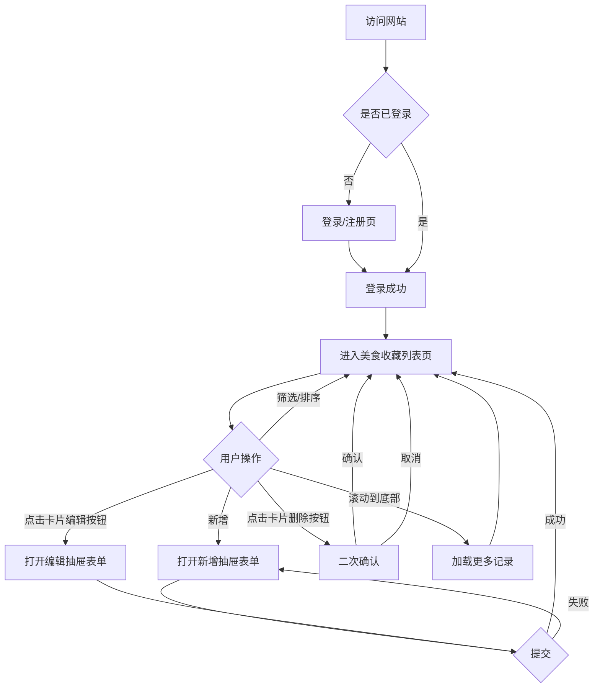
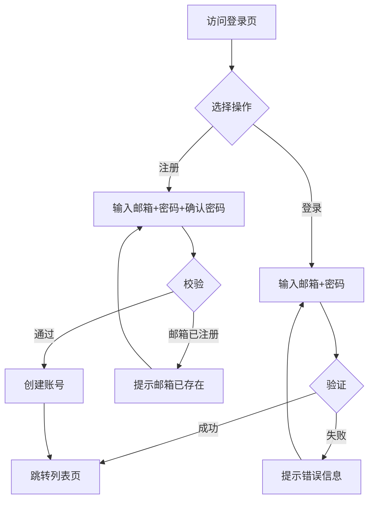
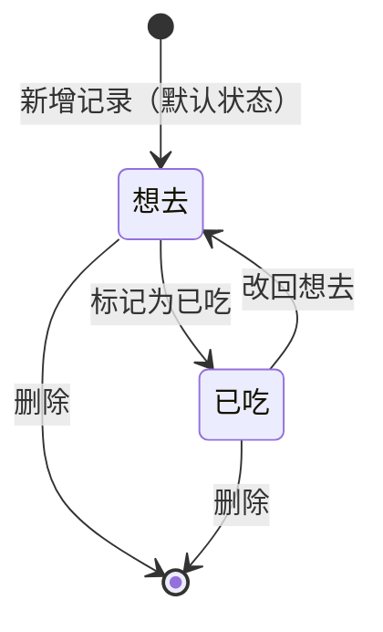
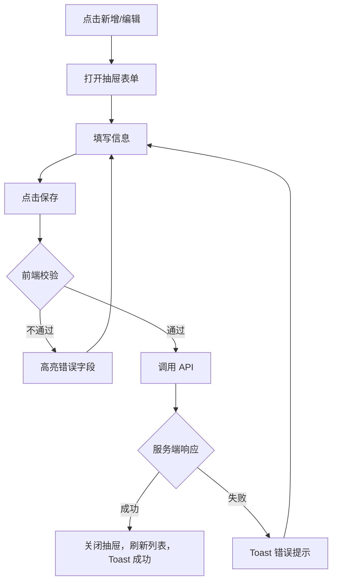

# 个人网站 · 美食收藏模块 产品需求文档（PRD）

版本号：V1.1.0

| 版本 | 时间 | 修订人 | 备注 |
|------|------|--------|------|
| V1.0.0 | 2026/05/20 | PM | 创建初版，覆盖美食收藏 MVP 功能 |
| V1.1.0 | 2026/05/20 | PM | 修复评审问题：移动端底部Tab导航、无限滚动、标签前后置条件、密码找回说明、rating约束、source_url长度、主流程图修正 |

---

## 一、概述（为什么做）

### 1.1 产品概述及目标

#### 1.1.1 背景介绍

日常刷小红书、朋友圈时会种草大量餐厅，但这些内容分散在各个平台，没有统一的地方沉淀。到了想吃饭的时候，脑子里一片空白，翻收藏夹又费时费力。现有工具（大众点评、地图收藏）偏公开评价，缺乏私人化、轻量的记录体验。

本产品是一个个人网站，美食收藏是第一个功能模块，解决"种草 → 记录 → 回顾"的完整链路。

#### 1.1.2 产品概述

一个支持多用户登录的个人网站，用户可以快速记录种草或吃过的餐厅，包含店名、地址、菜系、人均、来源链接、评分、标签、菜品等信息，并通过列表筛选/排序随时回顾。

#### 1.1.3 产品目标

**用户目标**

| 目标用户 | 用户目标 | 衡量指标 |
|---------|---------|---------|
| 注册用户 | 1 分钟内完成一次完整的餐厅记录 | 新增记录平均耗时 < 60s |
| 注册用户 | 快速找到符合当下场景的餐厅 | 筛选到目标记录 < 3 次操作 |

**业务目标**

| 目标 | 指标 | 目标值 | 达成时间 |
|------|------|--------|---------|
| 记录留存 | 单用户平均收藏数 | ≥ 10 家 | 上线后 1 个月 |
| 记录完整率 | 带标签的记录占比 | ≥ 50% | 上线后 1 个月 |

#### 1.1.4 目标用户

| 角色 | 描述 | 核心诉求 |
|------|------|---------|
| 注册用户 | 有记录美食习惯的个人用户 | 快速记录、方便回顾 |
| 访客 | 未登录状态 | 仅可访问登录/注册页 |

### 1.2 名词说明

| 名词 | 说明 |
|------|------|
| 美食记录 | 一条完整的餐厅收藏，包含店铺信息、菜品、评分、标签 |
| 系统标签 | 平台预设的标签，用户不可删除，可直接使用 |
| 自定义标签 | 用户自己创建的标签，仅对本人可见 |
| 想去 / 已吃 | 美食记录的两种状态，表示是否已实际到访 |

### 1.3 角色及权限

| 角色 | 权限范围 | 数据范围 |
|------|---------|---------|
| 注册用户 | 增删改查自己的美食记录、标签 | 仅本人数据 |
| 访客 | 仅可访问登录/注册页 | 无 |

### 1.4 文档阅读对象

| 对象 | 关注内容 |
|------|---------|
| 研发 | 功能需求、数据字典、接口设计 |
| UI/UX | 界面交互、设计风格、全局规则 |
| 测试 | 异常流程、验收标准 |

---

## 二、产品描述（做什么）

### 2.1 产品需求描述

**做什么：**
- 网站整体框架：顶部导航栏（按功能模块切换）+ 左侧菜单（当前模块的子导航）
- 美食收藏模块：新增/编辑/删除美食记录，列表展示并支持筛选排序
- 用户体系：注册、登录、各自独立的数据空间

**不做什么（V1.0 范围外）：**
- 社交功能（分享、关注、评论）
- 图片上传
- 地图可视化
- 数据导出

**技术约束：**
- 前端：React + Next.js（App Router）
- 数据库：PostgreSQL + Prisma ORM
- 认证：NextAuth.js（Credentials Provider）
- 部署：[待确认]

### 2.2 产品整体流程

#### 2.2.1 主流程



> 注：V1.0 无独立详情页，点击卡片的编辑/删除操作均在列表页内通过抽屉完成。

#### 2.2.2 用户认证子流程



#### 2.2.3 美食记录状态转换



### 2.3 全局说明

#### 2.3.1 全局异常处理

| 异常场景 | 处理方式 | 提示文案 |
|---------|---------|---------|
| 未登录访问 | 重定向到登录页 | - |
| 网络异常 | Toast 提示，支持重试 | "网络连接失败，请检查后重试" |
| 服务超时 | Toast 提示 | "请求超时，请稍后重试" |
| 服务器错误 | Toast 提示 | "服务器开小差了，请稍后再试" |
| 数据不存在 | 显示空状态页 | "内容不存在或已被删除" |
| 权限异常 | 提示并阻止操作 | "无权限操作" |

#### 2.3.2 列表通用规则

| 规则项 | 说明 |
|--------|------|
| 分页 | 默认 20 条/页 |
| 默认排序 | 按创建时间倒序 |
| 空数据 | 显示插画 + "还没有记录，快去添加第一家吧" |
| 加载中 | 骨架屏占位 |

#### 2.3.3 全局交互规范

| 场景 | 交互方式 |
|------|---------|
| 操作成功 | Toast 提示，1.5s 后自动消失 |
| 操作失败 | Toast 提示错误原因 |
| 删除操作 | 弹出确认对话框，需二次确认 |
| 表单提交中 | 按钮显示 loading 状态并禁用，防重复提交 |
| 必填项未填 | 提交时高亮未填字段并滚动到第一个错误处 |

### 2.4 产品版本规划

| 版本 | 范围 | 计划时间 | 状态 |
|------|------|---------|------|
| V1.0 | 网站框架 + 用户认证 + 美食收藏（记录+列表） | 2026/06 | 进行中 |
| V1.1 | 美食收藏增强（菜品记录、图片上传） | 待定 | 规划中 |
| V2.0 | 第二功能模块（TBD） | 待定 | 远期 |

### 2.5 产品框架

```
个人网站
├── 顶部导航栏
│   ├── 美食收藏（当前模块）
│   └── [未来模块占位]
│
└── 美食收藏模块
    ├── 左侧菜单
    │   ├── 全部收藏
    │   ├── 想去清单
    │   ├── 已吃清单
    │   └── 标签管理
    └── 主内容区
        ├── 列表页（筛选栏 + 卡片列表）
        └── 新增/编辑表单（抽屉或弹窗）
```

### 2.6 功能清单

| 模块 | 功能 | 优先级 | 版本 |
|------|------|--------|------|
| 用户认证 | 注册（邮箱+密码） | P0 | V1.0 |
| 用户认证 | 登录 / 登出 | P0 | V1.0 |
| 网站框架 | 顶部导航 + 左侧菜单布局 | P0 | V1.0 |
| 网站框架 | 移动端响应式适配 | P0 | V1.0 |
| 美食收藏 | 新增美食记录 | P0 | V1.0 |
| 美食收藏 | 编辑美食记录 | P0 | V1.0 |
| 美食收藏 | 删除美食记录 | P0 | V1.0 |
| 美食收藏 | 列表展示（卡片式） | P0 | V1.0 |
| 美食收藏 | 按状态筛选（想去/已吃） | P0 | V1.0 |
| 美食收藏 | 按标签/菜系/评分筛选 | P1 | V1.0 |
| 美食收藏 | 排序（时间/评分/人均） | P1 | V1.0 |
| 美食收藏 | 标签管理（查看/新增/删除自定义标签） | P1 | V1.0 |
| 美食收藏 | 菜品记录（每家店下的菜品列表） | P2 | V1.1 |
| 美食收藏 | 图片上传 | P2 | V1.1 |

---

## 三、功能需求（怎么做）

### 3.1 用户认证

#### 3.1.1 描述
支持用户通过邮箱+密码注册和登录，登录后各自独立的数据空间，互不可见。

#### 3.1.2 用户故事
```
作为新用户，我希望用邮箱注册账号，以便开始记录我的美食收藏。
作为已注册用户，我希望登录后直接进入我的收藏列表，以便继续使用。
```

#### 3.1.3 前置条件

| 类型 | 条件 |
|------|------|
| 注册 | 邮箱未被注册过 |
| 登录 | 邮箱已注册，密码正确 |

#### 3.1.4 后置条件
- 注册成功：创建用户账号，自动登录，跳转到美食收藏列表页
- 登录成功：建立 session，跳转到美食收藏列表页
- 登出成功：清除 session，跳转到登录页

#### 3.1.5 界面及交互

**登录/注册页**（共用一个页面，Tab 切换）

| 元素 | 类型 | 必填 | 校验规则 | 操作反馈 |
|------|------|------|---------|---------|
| 邮箱 | 文本输入框 | 是 | 合法邮箱格式 | 格式错误时字段变红并提示 |
| 密码 | 密码输入框 | 是 | 8-20 位，含字母和数字 | 不符合时提示规则 |
| 确认密码（注册） | 密码输入框 | 是 | 与密码字段一致 | 不一致时提示 |
| 提交按钮 | Button | - | - | 提交中显示 loading |

#### 3.1.6 异常/分支流程

| 场景 | 触发条件 | 处理方式 | 提示文案 |
|------|---------|---------|---------|
| 邮箱已注册 | 注册时邮箱重复 | 字段报错 | "该邮箱已被注册" |
| 密码错误 | 登录时密码不匹配 | 提示错误 | "邮箱或密码错误" |
| 账号不存在 | 登录时邮箱未注册 | 提示错误（同上，不暴露枚举） | "邮箱或密码错误" |
| 重复提交 | 点击提交后再次点击 | 按钮 loading 禁用 | - |

#### 3.1.7 数据字典（users 表）

| 字段名 | 类型 | 必填 | 说明 | 示例值 |
|--------|------|------|------|--------|
| id | String(cuid) | 是 | 主键 | "clxxx..." |
| email | String(255) | 是 | 邮箱，唯一索引 | "user@example.com" |
| password_hash | String | 是 | bcrypt 加密后的密码 | "$2b$10$..." |
| name | String(50) | 否 | 昵称，默认取邮箱前缀 | "小王" |
| created_at | DateTime | 是 | 注册时间 | 2026-05-20 10:00:00 |
| updated_at | DateTime | 是 | 最后更新时间，@updatedAt 自动维护 | 2026-05-20 10:00:00 |

---

### 3.2 美食记录 · 新增 / 编辑

#### 3.2.1 描述
用户通过表单填写餐厅信息，完成一次美食记录的创建或修改。

#### 3.2.2 用户故事
```
作为用户，我希望快速填写店名、评分和标签就能保存一条记录，以便不打断刷手机的节奏。
作为用户，我希望编辑已有记录，以便在实际到访后补充菜品和评分。
```

#### 3.2.3 前置条件

| 类型 | 条件 |
|------|------|
| 权限 | 用户已登录 |
| 编辑 | 记录属于当前登录用户 |

#### 3.2.4 后置条件
- 新增成功：记录写入数据库，列表页刷新，Toast 提示"添加成功"
- 编辑成功：记录更新，Toast 提示"保存成功"

#### 3.2.5 界面及交互

表单以右侧抽屉（Drawer）形式展示，不离开列表页。

| 元素 | 类型 | 必填 | 默认值 | 校验规则 | 说明 |
|------|------|------|--------|---------|------|
| 店名 | 文本输入框 | 是 | - | 1-50 字符 | - |
| 状态 | Radio | 是 | 想去 | - | 想去 / 已吃 |
| 评分 | 星级选择器 | 是 | - | 1-5 颗星 | 点击星星选择 |
| 菜系 | 下拉选择 | 否 | 请选择 | - | 见菜系枚举 |
| 人均价格 | 数字输入框 | 否 | - | 正整数，≤ 9999 | 单位：元 |
| 地址 | 文本输入框 | 否 | - | ≤ 100 字符 | - |
| 来源链接 | 文本输入框 | 否 | - | 合法 URL 格式 | 小红书/朋友圈链接 |
| 标签 | 多选标签组 | 否 | - | 最多选 10 个 | 系统标签+自定义标签 |
| 备注 | 多行文本框 | 否 | - | ≤ 200 字符 | - |
| 保存按钮 | Button | - | - | - | 提交中 loading |

**菜系枚举：** 川菜、粤菜、湘菜、东北菜、日料、韩料、西餐、火锅、烧烤、海鲜、面食、快餐、甜品、其他

#### 3.2.6 业务流程



#### 3.2.7 异常/分支流程

| 场景 | 触发条件 | 处理方式 | 提示文案 |
|------|---------|---------|---------|
| 店名为空 | 提交时店名未填 | 字段报错 | "请填写店名" |
| 评分未选 | 提交时未选评分 | 字段报错 | "请选择评分" |
| URL 格式错误 | 来源链接非合法 URL | 字段报错 | "请输入合法的链接地址" |
| 编辑他人记录 | 直接请求他人记录 ID | 返回 403 | "无权限操作" |
| 网络中断 | 提交时断网 | Toast 提示 | "网络连接失败，请重试" |

#### 3.2.8 数据字典（food_records 表）

| 字段名 | 类型 | 必填 | 说明 | 示例值 |
|--------|------|------|------|--------|
| id | String(cuid) | 是 | 主键 | "clxxx..." |
| user_id | String | 是 | 外键，关联 users.id | "clxxx..." |
| name | String(50) | 是 | 店名 | "老四川" |
| status | Enum | 是 | WANT_TO_GO / VISITED | "WANT_TO_GO" |
| rating | Int | 是 | 评分 1-5，取值约束 CHECK(rating >= 1 AND rating <= 5) | 4 |
| cuisine | String(20) | 否 | 菜系 | "川菜" |
| avg_price | Int | 否 | 人均价格（元） | 80 |
| address | String(100) | 否 | 地址 | "成都市锦江区..." |
| source_url | String(2000) | 否 | 来源链接 | "https://..." |
| note | String(200) | 否 | 备注 | "朋友推荐，必点夫妻肺片" |
| created_at | DateTime | 是 | 创建时间 | 2026-05-20 10:00:00 |
| updated_at | DateTime | 是 | 最后更新时间 | 2026-05-20 10:00:00 |

---

### 3.3 美食记录 · 列表展示

#### 3.3.1 描述
以卡片列表形式展示当前用户的所有美食记录，支持按状态、菜系、标签、评分筛选，以及按时间/评分/人均排序。

#### 3.3.2 用户故事
```
作为用户，我希望看到所有收藏的餐厅卡片，以便快速浏览和回顾。
作为用户，我希望筛选"想去"的川菜馆，以便今晚出门前快速决策。
```

#### 3.3.3 前置条件

| 类型 | 条件 |
|------|------|
| 权限 | 用户已登录 |

#### 3.3.4 后置条件
- 筛选/排序条件变更时，列表实时刷新（无需手动点击搜索）

#### 3.3.5 加载方式

**无限滚动（Infinite Scroll）：**
- 桌面端和移动端均采用无限滚动，不使用分页器
- 每次加载 20 条，滚动到距底部 200px 时触发下一批加载
- 加载中：底部显示 loading spinner
- 全部加载完毕：底部显示"已经到底啦 🍜"
- 加载失败：底部显示"加载失败，点击重试"

#### 3.3.5 界面及交互

**桌面端布局：**
- 左侧菜单：全部收藏 / 想去清单 / 已吃清单 / 标签管理
- 顶部筛选栏：菜系下拉、评分范围、标签多选、排序方式
- 主区域：卡片网格（桌面 3 列，平板 2 列）
- 右上角：新增按钮

**移动端布局（响应式自适应，≤ 768px）：**
- 底部 Tab 导航（固定，4 项）：全部 / 想去 / 已吃 / 标签
- 顶部筛选栏：横向可滚动的筛选 chip 组
- 主区域：单列卡片列表，无限滚动加载
- 右下角：浮动新增按钮（FAB，固定在屏幕右下角，避开 Tab 导航）
- 卡片操作：点击卡片右上角"..."图标，弹出操作菜单（编辑 / 删除）

**桌面端卡片内容：**

| 元素 | 说明 |
|------|------|
| 店名 | 加粗，最多 2 行截断 |
| 状态标签 | 想去（橙色）/ 已吃（绿色） |
| 评分 | 星星图标，显示数字 |
| 菜系 + 人均 | 次要信息，灰色小字 |
| 标签列表 | 最多显示 3 个，超出显示 +N |
| 操作按钮 | 编辑、删除（hover 时显示） |

**移动端卡片操作：**
- 卡片右上角常驻"..."按钮（可点击区域 ≥ 44×44px）
- 点击后弹出底部 ActionSheet：编辑 / 删除 / 取消

#### 3.3.6 筛选/排序规则

| 筛选项 | 类型 | 说明 |
|--------|------|------|
| 状态 | 左侧菜单切换 | 全部 / 想去 / 已吃 |
| 菜系 | 下拉单选 | 枚举值同新增表单 |
| 评分 | 下拉单选 | 1星及以上 / 3星及以上 / 5星 |
| 标签 | 多选 | 当前用户所有标签 |
| 排序 | 下拉单选 | 最新添加（默认）/ 评分最高 / 人均最低 |

#### 3.3.7 异常/分支流程

| 场景 | 触发条件 | 处理方式 |
|------|---------|---------|
| 无记录 | 用户未添加任何记录 | 显示空状态插画 + "还没有记录，快去添加第一家吧" + 新增按钮 |
| 筛选无结果 | 筛选条件下无匹配 | 显示"没有符合条件的记录" + 清除筛选按钮 |
| 删除确认 | 点击删除图标 | 弹出确认对话框："确认删除「店名」？删除后不可恢复" |

---

### 3.4 标签管理

#### 3.4.1 描述
用户可以查看系统预设标签和自己创建的自定义标签，并对自定义标签进行新增和删除。移动端通过底部 Tab 导航中的"标签"入口访问；桌面端通过左侧菜单的"标签管理"入口访问。

#### 3.4.2 用户故事
```
作为用户，我希望创建"出差备用"这样的个人标签，以便按自己的场景分类收藏。
```

#### 3.4.3 前置条件

| 类型 | 条件 |
|------|------|
| 权限 | 用户已登录 |

#### 3.4.4 后置条件
- 新增自定义标签成功后，该标签立即出现在新增/编辑记录表单的标签选项中
- 删除标签成功后，所有关联该标签的记录自动解除关联（记录本身不删除）

#### 3.4.5 界面及交互

| 元素 | 说明 |
|------|------|
| 系统标签区 | 展示所有预设标签，不可删除，灰色样式 |
| 自定义标签区 | 展示用户创建的标签，每个标签右侧有删除按钮 |
| 新增标签输入框 | 输入标签名 + 回车/点击添加 |

**系统预设标签：**
- 场景类：约会、家庭聚餐、朋友聚会、商务宴请、独食、外卖
- 特征类：排队长、需预约、停车方便、环境好、性价比高
- 时段类：早餐、午餐、晚餐、宵夜、下午茶

#### 3.4.4 异常/分支流程

| 场景 | 触发条件 | 处理方式 | 提示文案 |
|------|---------|---------|---------|
| 标签名重复 | 新增时与已有标签同名 | 输入框报错 | "标签已存在" |
| 标签名过长 | 超过 10 字符 | 输入框报错 | "标签名最多 10 个字符" |
| 删除被使用的标签 | 标签已关联记录 | 弹窗确认 | "该标签已用于 N 条记录，删除后这些记录将移除该标签，确认删除？" |

#### 3.4.5 数据字典（tags 表）

| 字段名 | 类型 | 必填 | 说明 | 示例值 |
|--------|------|------|------|--------|
| id | String(cuid) | 是 | 主键 | "clxxx..." |
| name | String(10) | 是 | 标签名 | "约会" |
| user_id | String | 否 | 为空表示系统标签 | null |
| created_at | DateTime | 是 | 创建时间 | 2026-05-20 |

**关联表（food_record_tags）：**

| 字段名 | 类型 | 说明 |
|--------|------|------|
| record_id | String | 外键，关联 food_records.id，级联删除 |
| tag_id | String | 外键，关联 tags.id，级联删除 |

---

### 3.5 用户认证 · 密码找回

#### 3.5.1 描述
V1.0 不支持自助密码重置。用户忘记密码时，登录页提示联系管理员处理。

> **[待确认]** 若后续需要支持邮件重置密码，需补充邮件服务配置（如 Resend / SendGrid）和重置流程。

#### 3.5.2 界面说明
- 登录页密码输入框下方显示灰色小字："忘记密码？请联系管理员"
- V1.0 该文字不可点击，仅作提示

---

## 四、非功能需求

### 4.1 安全与合规

| 需求 | 说明 |
|------|------|
| 密码存储 | bcrypt 加密，不存明文 |
| 传输安全 | 全站 HTTPS |
| 数据隔离 | 所有查询强制过滤 user_id，服务端校验，不依赖前端传参 |
| Session 安全 | NextAuth.js 管理，cookie httpOnly + secure |
| SQL 注入防护 | 使用 Prisma ORM，参数化查询 |

### 4.2 统计需求（埋点）

| 事件名 | 触发时机 | 属性 |
|--------|---------|------|
| page_view | 页面加载完成 | page_name, user_id |
| record_created | 美食记录保存成功 | has_rating, has_tags, cuisine |
| record_deleted | 删除记录确认后 | record_id |
| filter_applied | 筛选条件变更 | filter_type, filter_value |
| tag_created | 自定义标签创建成功 | - |

### 4.3 性能需求

| 指标 | 要求 |
|------|------|
| 列表页首屏 | < 1.5s（正常网络） |
| 接口响应时间 | P99 < 500ms |
| 移动端可用性 | 320px 宽度以上正常展示 |
| 并发 | [待确认] 个人使用，暂不作并发要求 |

### 4.4 数据库设计

核心表：`users`、`food_records`、`tags`、`food_record_tags`

索引策略：
- `food_records.user_id`：查询用户记录的主要过滤条件，必建索引
- `food_records.status`：列表按状态筛选，建复合索引 `(user_id, status)`
- `tags.user_id`：查询用户标签，建索引
- `food_record_tags`：`(record_id, tag_id)` 联合主键

数据生命周期：用户注销时级联删除所有关联记录（[待确认] 是否需要软删除/冷却期）

### 4.5 系统集成

V1.0 无第三方系统集成。NextAuth.js 作为内部认证服务，不依赖外部 OAuth。

---

## 五、附录

### 5.1 验收标准与测试要点

| 功能 | 验收条件 | 优先级 |
|------|---------|--------|
| 注册 | 合法邮箱+符合规则密码，注册成功后自动登录并跳转列表页 | P0 |
| 注册 | 已注册邮箱提示"该邮箱已被注册" | P0 |
| 登录 | 正确邮箱密码登录成功，错误密码提示"邮箱或密码错误" | P0 |
| 未登录访问 | 直接访问列表页重定向到登录页 | P0 |
| 新增记录 | 仅填店名+评分可保存成功 | P0 |
| 新增记录 | 未填店名点击保存，字段红色报错提示 | P0 |
| 新增记录 | 来源链接填写非 URL 格式，字段报错 | P1 |
| 编辑记录 | 修改后保存，列表页对应卡片内容更新 | P0 |
| 删除记录 | 点击删除弹出确认框，确认后记录消失，取消后不变 | P0 |
| 列表筛选 | 切换"想去/已吃"，列表仅显示对应状态记录 | P0 |
| 列表筛选 | 按菜系/标签筛选后，无匹配时显示空状态页 | P1 |
| 列表排序 | 按评分最高排序，5星记录排在前面 | P1 |
| 标签管理 | 新增自定义标签，在新增记录表单的标签选项中出现 | P1 |
| 标签管理 | 系统标签无删除按钮 | P1 |
| 数据隔离 | 用户 A 无法看到或操作用户 B 的记录（直接请求 API 返回 403） | P0 |
| 移动端 | 375px 宽度下列表卡片单列展示，表单可正常操作 | P1 |

---

## 待确认项清单

### 必须确认（阻塞开发）
1. [待确认] 部署平台？（Vercel / 自建服务器 / 其他）→ 影响数据库选型和环境变量配置

### 建议确认（影响完整度）
2. [待确认] 用户注销功能是否需要？注销后数据是永久删除还是保留？→ 见 4.4 节
3. [待确认] 列表页是否需要搜索框（按店名搜索）？→ 见 2.6 功能清单
4. [待确认] 标签多选筛选逻辑：选中多个标签时是 AND（同时满足）还是 OR（满足任一）？→ 见 3.3.6

### 已确认
- ✅ 移动端自适应：底部 Tab 导航（全部/想去/已吃/标签）→ 见 3.3.5
- ✅ 列表加载方式：无限滚动，每次 20 条 → 见 3.3.5
- ✅ 密码找回：V1.0 不支持自助重置，登录页提示联系管理员 → 见 3.5
- ✅ 点击卡片：无独立详情页，编辑/删除均在列表页内通过抽屉完成 → 见 2.2.1

### 可后续补充
5. [待确认] 灰度/上线策略？→ 见 2.4 版本规划
6. [待确认] 埋点平台选型（GA / 自建 / 暂不接）→ 见 4.2 节
7. [待确认] 后续是否支持邮件重置密码？需要邮件服务配置 → 见 3.5


