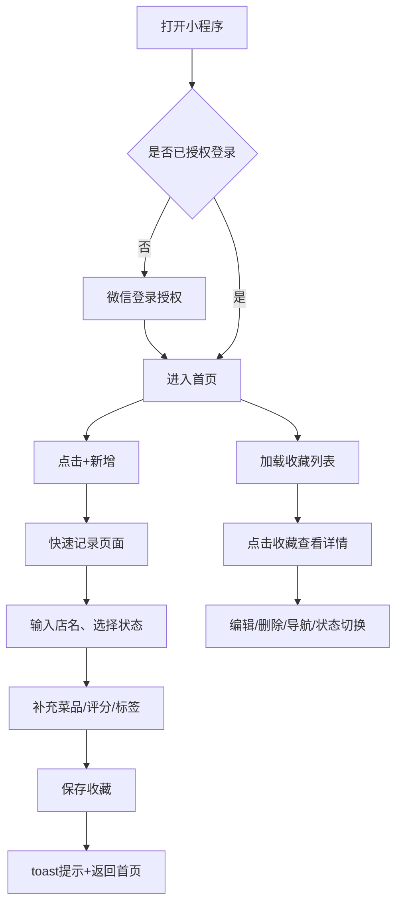
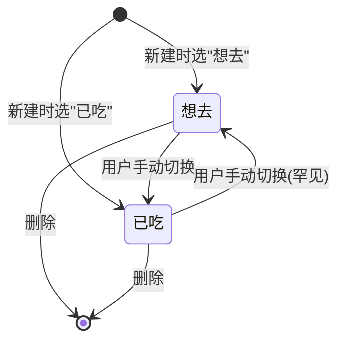
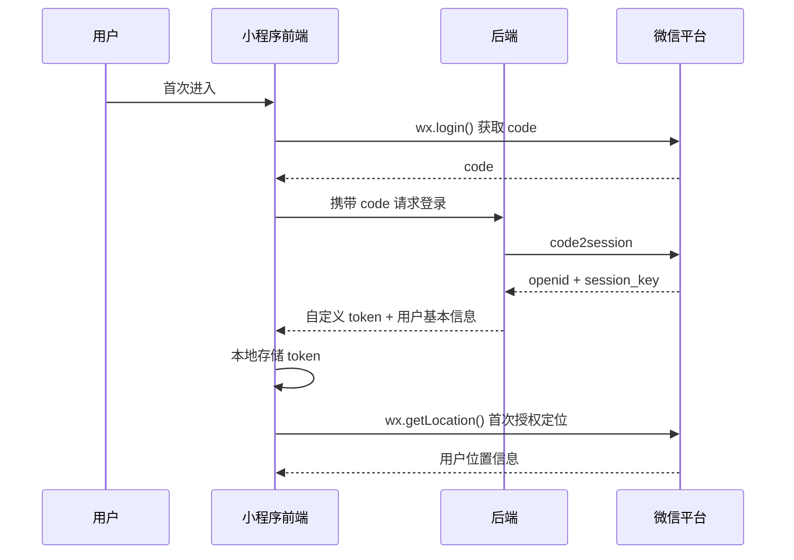
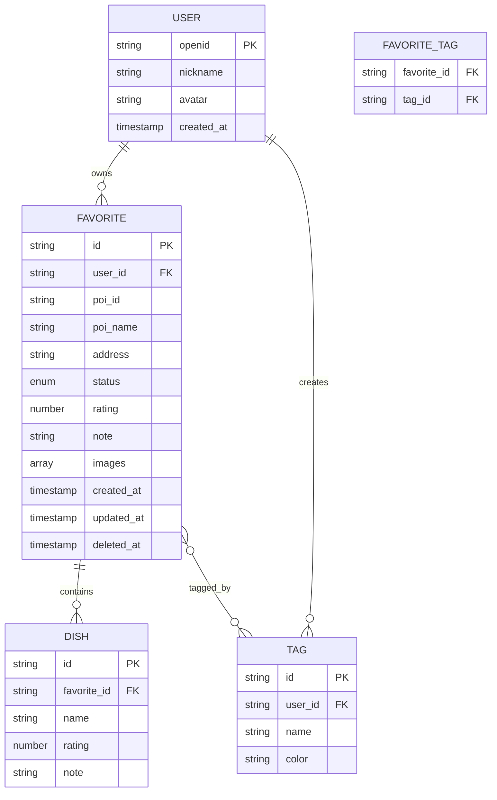

# 美食收藏小程序 PRD V1.0

> 工作名："馋图"（最终命名可由用户决定）
> 形态：微信小程序
> 定位：个人美食收藏与地图查找工具

## 版本记录

| 版本 | 日期 | 修订人 | 备注 |
|------|------|--------|------|
| V1.0 | 2026-05-19 | PM | 初版 PRD，覆盖 MVP 全部核心功能 |
| V1.0 | 2026-05-19 | PM | 评审后调整：移除地图模式 & 附近推荐；删除搜索框第二入口；确认定位授权流程 |

---

## 一、概述

### 1.1 产品概述及目标

#### 1.1.1 背景介绍

吃货用户日常面临三类痛点：

1. **记不住吃过的好店**：探店时觉得好吃，过两周想推荐给朋友、想自己再去时，已经想不起店名/位置
2. **种草的店容易遗忘**：刷小红书/朋友圈种草的店，没有统一的地方沉淀，到了目的地附近也想不起
3. **现有工具不贴合个人收藏**：大众点评偏公开评价、地图 App 收藏分类弱、备忘录无地图维度

市面上没有一款"私人化、轻量、地图化"的美食收藏工具，本产品填补这个空白。

#### 1.1.2 产品概述

一款微信小程序，用户可以：
- 通过**纯文字快速记录**方式收藏美食
- 在**菜品维度**记录每家店吃过什么、评分如何
- 用**自定义标签**管理收藏（如"早餐""约会""出差备用"）
- 维护**想去清单**与**已吃清单**两种状态

#### 1.1.3 产品目标

**用户目标：**
- 1 分钟内能完成一次"店 + 菜品 + 评分 + 标签"的完整记录
- 用想去清单做出行决策时，能快速筛选并导航

**业务目标（个人项目，验证向）：**
- MVP 上线后，单个用户平均收藏数 ≥ 10 家店（说明留存有效）
- 收藏完整率 ≥ 60%（带菜品+标签的占总收藏比例，说明记录闭环有效）
- 7 日次留率 ≥ 30%（说明工具属性立住了）

#### 1.1.4 目标用户

| 用户类型 | 画像 | 核心诉求 |
|---------|------|---------|
| 主用户 | 18-35 岁城市白领/学生，每周外食 ≥ 3 次，会主动探店 | 私人收藏、不想公开、地图找店 |
| 次用户 | 出差/旅行用户 | 提前种草+到地了快速翻收藏 |

> 本版本**不做社交**：不分享、不互看、不评论，纯私人工具。

### 1.2 名词说明

| 名词 | 解释 |
|------|------|
| 收藏 | 用户对一家店铺的记录条目，包含店铺信息+菜品+评分+标签等 |
| 店铺 | 一个 POI（Point of Interest），含名称、地址、经纬度 |
| 菜品 | 在某家店内吃过的具体食物条目 |
| 标签 | 用户自定义的分类词，多对多关联收藏 |
| 状态 | 收藏的两种状态：`想去` / `已吃` |
| POI | 地理位置点，本产品通过微信小程序 `wx.chooseLocation` 或腾讯位置服务获取 |

### 1.3 角色及权限

V1.0 仅单一角色：**普通用户（小程序登录用户）**。

| 角色 | 权限 |
|------|------|
| 未登录用户 | 仅可浏览小程序首页与功能介绍，不可创建/查看收藏 |
| 登录用户 | 全部功能：创建/编辑/删除自己的收藏、标签、菜品 |

> 不设管理员角色。无需后台管理界面。

### 1.4 文档阅读对象

个人开发者（自学/练手），同时可作为后续协作时给前端、后端、设计师参考的基础文档。

---

## 二、产品描述

### 2.1 产品需求描述

用户进入小程序后，查看自己的全部收藏列表。新增收藏通过快速文字记录方式：直接输入店名 → 选择状态/菜品/标签 → 保存。

### 2.2 产品整体流程

#### 2.2.1 主流程图



#### 2.2.2 状态转换图

收藏的两种状态切换：



### 2.3 全局说明

#### 2.3.1 异常处理（全局）

| 场景 | 处理方式 |
|------|---------|
| 未授权微信登录 | 弹窗提示"需要登录才能使用收藏功能"，提供"登录"和"先逛逛"两个按钮 |
| 未授权地理位置 | 部分功能降级：地图找店功能受限；提示"开启定位以使用地图找店" |
| 网络异常 | toast 提示"网络异常，请稍后重试"，已加载的本地缓存数据正常显示 |
| 接口超时（>10s） | toast 提示"加载超时"，保留上次成功的数据 |
| 服务端 500 | toast 提示"服务异常"，上报埋点 |
| 操作冲突（如重复保存） | 后端幂等去重，前端按钮置 loading 防双击 |

#### 2.3.2 列表规则（全局）

- 默认按 `创建时间倒序` 排列
- 单页加载 20 条，下拉刷新、上拉加载更多
- 空状态：展示插画 + "还没有收藏，去添加你的第一家店吧"按钮

#### 2.3.3 全局交互

- 主色调：暖色调（建议 #FF6B35 番茄橙），契合"美食"定位
- 主要操作按钮固定在底部，方便单手操作
- 删除等不可逆操作必须二次确认

### 2.4 产品版本规划

| 版本 | 范围 | 说明 |
|------|------|------|
| V1.0 (MVP) | 本文档全部功能 | 单用户、本地+云端存储、基础地图 |
| V1.1 | 数据导出（生成图片/PDF 收藏夹） | 加强工具属性 |
| V2.0 | 多设备同步、备份恢复 | 提升可靠性 |
| V3.0（可选） | 好友分享（仅看，不评论） | 仅当用户主动要求时再做 |

### 2.5 产品框架

```
首页（Tab）
├── 列表模式
│   ├── 搜索框（顶部）
│   ├── 筛选栏（全部/想去/已吃）
│   └── 收藏卡片
├── 新增按钮（悬浮）
│   └── 快速文字记录
我的（Tab）
├── 收藏统计（已吃X家 / 想去Y家）
├── 我的标签
├── 设置
└── 关于
```

### 2.6 功能清单

| 编号 | 功能模块 | 优先级 | 说明 |
|------|---------|--------|------|
| F1 | 微信登录 | P0 | 基础能力 |
| F3 | 快速文字记录 | P0 | 核心路径 |
| F4 | 收藏详情查看 | P0 | 闭环必需 |
| F5 | 收藏编辑/删除 | P0 | 闭环必需 |
| F7 | 列表模式浏览 | P0 | 基础浏览 |
| F8 | 菜品维度记录 | P0 | 用户明确要求 |
| F9 | 标签管理 | P0 | 用户明确要求 |
| F10 | 想去清单 | P0 | 用户明确要求 |
| F12 | 一键导航 | P1 | 调用微信内置地图 |
| F13 | 标签管理页 | P1 | 增删改标签 |

---

## 三、功能需求

### 3.1 F3 快速文字记录

#### 3.1.1 描述

用户直接输入店名/菜品文字记录。适用于"在路上想起以前吃过某家店"或"网上看到一家店先存下"的场景。

#### 3.1.2 用户故事

作为一个**吃货用户**，我希望**快速记下店和菜**，以便**任何时候都能记录灵感**。

#### 3.1.3 前置条件

用户已登录。

#### 3.1.4 后置条件

收藏记录创建，`poi_id` 可为空。埋点 `food_create_success`，参数 `创建方式 = quick`。

#### 3.1.5 界面及交互

| 元素 | 类型 | 默认值 | 校验/说明 |
|------|------|--------|----------|
| 店名 | input | 空 | 必填，1-50 字 |
| 状态 | radio | 想去 | 想去 / 已吃 |
| 评分 | 5 星 | 0 | 已吃时必填 |
| 菜品 | dynamic list | 空 | 同 3.2 |
| 标签 | chip | 空 | 同 3.3 |
| 备注 | textarea | 空 | ≤200 字 |
| 图片 | uploader | 空 | 最多 9 张，单张 ≤ 5MB |

#### 3.1.6 异常/分支流程

| 异常 | 处理 |
|------|------|
| 店名为空 | 保存按钮置灰 |

#### 3.1.7 数据字典：收藏（favorite）

| 字段 | 类型 | 必填 | 说明 | 示例 |
|------|------|------|------|------|
| id | string | 是 | 收藏ID，UUID | "fav_001" |
| user_id | string | 是 | 用户 openid | "oABC..." |
| poi_id | string | 否 | 腾讯地图 POI ID | "12345" |
| poi_name | string | 是 | 店名，1-50 字 | "阿大葱油饼" |
| address | string | 否 | 详细地址 | "上海市..." |
| status | enum | 是 | `want` / `eaten` | "eaten" |
| rating | number | 否 | 1-5，已吃必填 | 4.5 |
| dishes | array | 否 | 菜品数组，见 3.2 | [...] |
| tags | array<string> | 否 | 标签 ID 数组 | ["t1","t2"] |
| note | string | 否 | 备注，≤200 字 | "..." |
| images | array<string> | 否 | 图片 URL 数组 | [...] |
| created_at | timestamp | 是 | 创建时间 | 1747640000 |
| updated_at | timestamp | 是 | 更新时间 | 1747640000 |
| deleted_at | timestamp | 否 | 软删除时间 | null |

### 3.2 F8 菜品维度记录

#### 3.3.1 描述

每条收藏可附带 0~N 个菜品记录，每个菜品独立记名称、评分、备注。

#### 3.3.2 界面及交互

在收藏编辑页内嵌的动态列表：

- 默认折叠为"+ 添加菜品"按钮
- 点击展开为一行：菜品名 input + 5 星评分 + 删除 icon
- 每行下方有"+ 再加一道"

#### 3.3.3 数据字典：菜品（dish）

| 字段 | 类型 | 必填 | 说明 | 示例 |
|------|------|------|------|------|
| id | string | 是 | 菜品ID | "dish_001" |
| favorite_id | string | 是 | 关联收藏ID | "fav_001" |
| name | string | 是 | 菜品名，1-30 字 | "葱油饼" |
| rating | number | 否 | 1-5 星 | 5 |
| note | string | 否 | 简短备注，≤50 字 | "酥脆" |

#### 3.3.4 异常/分支

- 菜品名为空时该条不保存（保存收藏时静默过滤空行）
- 单条收藏菜品数 ≤ 20（防滥用）

### 3.4 F9 标签管理

#### 3.4.1 描述

用户可自定义标签，标签与收藏多对多关联。常见标签预设："早餐""午餐""晚餐""下午茶""夜宵""约会""出差""家附近"。

#### 3.4.2 界面及交互

**在收藏编辑页：**
- 横向滚动的 chip 列表，展示用户已有标签
- 已选中标签高亮
- 末尾固定 "+ 新建" chip，点击弹出输入框

**在我的-标签管理页：**
- 列表展示所有标签，每行：标签名 + 使用次数 + 编辑/删除 icon
- 顶部"+ 新建标签"按钮

#### 3.4.3 数据字典：标签（tag）

| 字段 | 类型 | 必填 | 说明 | 示例 |
|------|------|------|------|------|
| id | string | 是 | 标签ID | "tag_001" |
| user_id | string | 是 | 所属用户 | "oABC..." |
| name | string | 是 | 标签名，1-10 字 | "约会" |
| color | string | 否 | 颜色 hex，默认主题色 | "#FF6B35" |
| created_at | timestamp | 是 | - | - |

#### 3.4.4 异常/分支

| 异常 | 处理 |
|------|------|
| 重名 | 提示"标签已存在"，不创建 |
| 超长（>10字） | 输入框限制不让继续输入 |
| 删除使用中的标签 | 二次确认"该标签关联X条收藏，删除后会解除关联" |
| 标签总数 > 50 | 提示"标签数量已达上限，请清理后再新建" |

### 3.5 F10 想去清单

#### 3.5.1 描述

`想去` 与 `已吃` 是收藏的两种状态。想去清单本质上是 `status=want` 的筛选视图。

#### 3.5.2 界面及交互

**列表模式顶部**有三个 Tab：

- 全部
- 想去（badge 显示数量）
- 已吃（badge 显示数量）

**地图模式**：想去图钉用空心样式，已吃图钉用实心样式，颜色区分。

**详情页底部**有"标记为已吃"/"标记为想去"切换按钮。

#### 3.5.3 异常/分支

- 状态切换后，若从想去 → 已吃，弹窗提示"补充评分？"（可跳过）

### 3.6 F4 收藏详情 & F5 编辑/删除

#### 3.6.1 详情页内容

- 顶部：图片轮播
- 店铺信息：店名、地址
- 状态标签 + 评分
- 菜品列表（点亮评分星星）
- 标签 chip
- 备注
- 创建/更新时间
- 底部按钮区：导航 / 编辑 / 删除 / 状态切换

二次确认弹窗 → 软删除（`deleted_at` 置当前时间）→ 30 天后后端定时任务硬删除。

#### 3.6.3 一键导航（F12）

点击导航 → 调用 `wx.openLocation`，跳转微信内置地图。无坐标时按钮置灰，toast 提示"该收藏未记录位置"。

### 3.7 F1 微信登录

#### 3.7.1 流程



#### 3.7.2 异常

| 异常 | 处理 |
|------|------|
| code 过期 | 重新调 wx.login |
| 后端登录失败 | toast"登录失败，请重试"，可重试 |
| 定位授权被拒绝 | 地图相关功能降级，提示"开启定位获得更好体验" |

---

## 四、非功能需求

### 4.1 安全与合规

- **隐私协议**：首次进入弹窗，需用户勾选才能进入；包含定位、相册、收藏数据用途说明
- **数据归属**：所有收藏仅当前用户可见，后端按 `user_id` 严格隔离
- **图片合规**：上传图片走微信 `wx.uploadFile` + 后端 OSS，OSS 开启鉴黄能力（V1.1 接入）
- **小程序合规**：遵守《微信小程序运营规范》，无禁用类目内容；定位权限按需申请
- **删除合规**：用户注销账号后 30 天内清空个人数据（V1.1）

### 4.2 统计需求（埋点）

| 事件名 | 触发时机 | 必备参数 | 备注 |
|--------|---------|---------|------|
| `app_launch` | 小程序启动 | scene（场景值） | - |
| `page_view_home` | 首页 PV | - | - |
| `page_view_detail` | 收藏详情 PV | favorite_id | - |
| `food_create_start` | 点击新增按钮 | entry（map/quick） | - |
| `food_create_success` | 保存成功 | entry, has_image, has_dish, has_tag, status | 衡量收藏完整率 |
| `food_create_fail` | 保存失败 | reason | - |
| `status_switch` | 状态切换 | from, to, favorite_id | 衡量想去→已吃转化 |
| `navigate_click` | 点击导航 | favorite_id | - |
| `tag_create` | 新建标签 | - | - |
| `error` | 任何接口异常 | api, code, message | 兜底监控 |

> 选型建议：微信小程序基础 `wx.reportEvent` 或接入有数/神策。**[待确认]** 由你决定。

### 4.3 性能需求

| 指标 | 目标 | 说明 |
|------|------|------|
| 收藏列表首屏 | ≤ 800ms | 20 条数据，含本地定位 |
| POI 搜索响应 | ≤ 500ms | 走腾讯位置服务 |
| 保存接口 | ≤ 1s | 不含图片上传 |
| 图片单张上传 | ≤ 3s | 5MB 以内 |

### 4.4 数据库设计（简版 ER 图）



### 4.5 系统集成

| 系统 | 用途 | 集成方式 |
|------|------|---------|
| 微信开放平台 | 登录、获取 openid | wx.login + code2session |
| 腾讯位置服务 | POI 搜索、关键词补全 | webservice API（需申请 key） |
| 微信内置地图 | 一键导航 | wx.openLocation |
| 微信小程序 map 组件 | 地图渲染、图钉 | 原生组件 |
| 后端服务 | CRUD、用户数据 | RESTful API，自建或云开发 |
| 对象存储 | 图片存储 | 微信云开发存储 或 自建 OSS |

> **[假设]** 个人项目，建议使用 **微信云开发**（云函数 + 云数据库 + 云存储），免运维。如选自建，需额外考虑后端框架（建议 Node.js + Koa / Python + FastAPI）。

---

## 五、附录

### 5.1 验收标准与测试要点

#### 5.1.1 核心验收用例

| # | 用例 | 期望 |
|---|------|------|
| 1 | 全新用户首次进入，授权登录 | 进入首页，列表展示空状态引导 |
| 2 | 通过地图找店，搜索"葱油饼"选中第一家，填写菜品+评分+标签，保存 | 列表能看到该收藏 |
| 3 | 不开启定位，点击新增-快速记录，仅填店名保存 | 保存成功，列表展示 |
| 4 | 同一家店重复添加 | 提示已收藏，跳到详情 |
| 5 | 收藏状态从想去切换到已吃 | 弹补充评分提示，状态切换成功 |
| 6 | 删除一个标签 | 关联收藏的标签被解除，不影响收藏本身 |
| 7 | 点击导航 | 唤起微信内置地图，能开始导航 |
| 8 | 删除收藏 | 列表不再显示该条 |
| 9 | 网络断开后打开 | 列表展示缓存，操作类按钮 toast 提示无网络 |

#### 5.1.2 边界用例

- 创建 0 个菜品 → 允许保存
- 创建 21 个菜品 → 限制 + 提示
- 标签数达 50 → 新建按钮置灰
- 上传 10 张图 → 限制 + 提示
- 备注超 200 字 → 输入框限制

---

## 六、待确认项清单

### 必须确认（阻塞开发）

1. **[决策完成]** 地图模式与附近推荐功能已从 V1.0 移除。
2. **[决策完成]** 距离显示功能已删除，数据字典移除 longitude/latitude 字段。
3. **[假设]** 后端技术选型为**微信云开发**（云函数+云数据库+云存储）。 → 见 4.5
4. **[假设]** 地图与 POI 搜索使用**腾讯位置服务**（小程序原生兼容好，免费额度足够个人项目）。 → 见 4.5
5. **[假设]** 主色调暂定 **#FF6B35 番茄橙**。 → 见 2.3.3

### 建议确认（影响完整度）

6. **[待确认]** 小程序最终命名（暂用"馋图"）。 → 见标题
7. **[待确认]** 是否需要 logo / 图标方案？V1.0 可先用 emoji 🍜 兜底。
8. **[待确认]** 埋点工具选型：原生 `wx.reportEvent` / 有数 / 神策。 → 见 4.2

### 可后续补充

9. **[后续版本]** 灰度策略（个人小程序通常无需，直接发布）。
10. **[后续版本]** 数据导出功能（生成图片/PDF 收藏夹）。
11. **[后续版本]** 图片鉴黄能力接入。
12. **[后续版本]** 地图模式、附近推荐、距离显示功能。

---

## 七、下一步建议

1. 确认待确认项清单中的 5-8 项
2. 用 Figma / 即时设计 出 5 个核心页面的原型（首页列表、新增-地图找店、新增-快速记录、新增-填写信息、收藏详情）
3. 申请：微信小程序账号、腾讯位置服务 key、（可选）云开发环境
4. 按功能优先级 P0 排迭代，建议 V1.0 拆 3 个 sprint：登录+列表骨架 → 新增+地图找店 → 详情+标签+搜索
